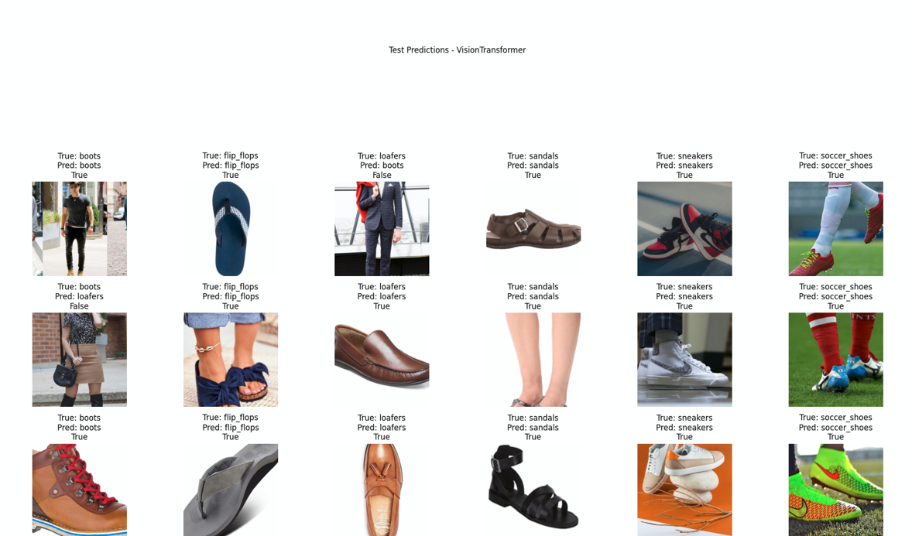

# Deep-Shoes-Classification
<p align="center">
  
</p>

Using deep Learning to classify the type of shoes

This repository contains a comprehensive deep learning project for shoe type classification using various models including ResNet, EfficientNet, MobileNetV2, Vision Transformers, DenseNet, and YOLOv8-Ultralytics.

## Table of Contents
- [Introduction](#introduction)
- [Project Structure](#project-structure)
- [Requirements](#requirements)
- [Installation](#installation)
- [Dataset](#dataset)
- [Models Implemented](#models-implemented)
- [Data Preprocessing & Augmentation](#data-preprocessing--augmentation)
- [Training](#training)
- [Evaluation](#evaluation)
- [Results](#results)
- [Future Work](#future-work)
- [Acknowledgements](#acknowledgements)
- [Contact](#contact)

## Introduction

This project implements shoe type classification using deep learning models with PyTorch and TensorFlow. The project explores various architectures, including ResNet, EfficientNet, MobileNetV2, Vision Transformers, DenseNet, and YOLOv8-Ultralytics. The dataset is processed, augmented, and used to train the models, followed by a comparative analysis of the results.

## Project Structure
```
shoes-type-classification/
├── data/
│   ├── train/
│   │   ├── class1/
│   │   ├── class2/
│   │   └── ...
│   ├── val/
│   │   ├── class1/
│   │   ├── class2/
│   │   └── ...
│   └── test/
│       ├── class1/
│       ├── class2/
│       └── ...
├── notebooks/
│   ├── Classification-Deep-5-Model-With-Augment.ipynb
│   ├── yolov8-CLS.ipynb
│   └── ...
├── models/
│   ├── ResNet101.pth
│   ├── EfficientNetB0.pth
│   ├── MobileNetV2.pth
│   ├── VisionTransformer.pth
│   ├── DenseNet121.pth
│   └── YOLOv8.pth
├── utils/
│   ├── split.py
│   └── Augmentation.py
├── README.md
└── requirements.txt
```


## Requirements

- Python 3.8+
- PyTorch
- TensorFlow
- Albumentations
- YOLOv8-Ultralytics
- Matplotlib
- Imageio
- Notebooks (Jupyter)
- Other dependencies specified in `requirements.txt`

## Installation

1. Clone the repository:
   ```bash
   git clone https://github.com/AISoltani/shoes-type-classification.git
   cd shoes-type-classification
Install the required packages:
bash
pip install -r requirements.txt

## Dataset
The dataset consists of images of shoes, categorized into six classes. The data is split into training, validation, and test sets. You can use the provided split.py script to manage the dataset splits.

## Models Implemented
**ResNet101:** A deep residual network suitable for complex image classification tasks.
**EfficientNetB0:** A model optimized for efficiency with balanced scaling of depth, width, and resolution.
**MobileNetV2:** Designed for mobile and embedded devices, lightweight and efficient.
**Vision Transformers (ViT):** Processes images as sequences of patches with self-attention mechanisms.
**DenseNet121:** Uses dense connections between layers for better feature reuse and efficient training.
**YOLOv8-Ultralytics:** A model for real-time object detection adapted for classification tasks.
Data Preprocessing & Augmentation
**Preprocessing:** Images are resized to 224x224, normalized, and standardized.
**Augmentation:** Various techniques such as rotation, flipping, color jittering, and noise addition are applied using both internal (PyTorch) and external (Albumentations) libraries.
Training
The models are trained with early stopping, data augmentation, and evaluation metrics like accuracy, precision, recall, and F1-score. Training scripts are provided in the notebooks directory.

## Evaluation
The performance of the models is evaluated using accuracy, precision, recall, and F1-score. Confusion matrices and other visualizations are also provided to analyze the results.

## Results
A comparative analysis of the models shows the following performance:

**VisionTransformer:** Best overall performance with highest accuracy (0.90).
**ResNet101:** Strong performance with good balance across metrics.
**DenseNet121:** High-performing with slightly less balance.
**EfficientNetB0:** Moderate performance with room for improvement in certain classes.
**MobileNetV2:** Lowest overall performance with significant variance in class performance.
For detailed results, please refer to the notebooks directory.

## Future Work
Ensemble Methods: Combining predictions from multiple models to improve overall performance.
Hyperparameter Optimization: Further tuning to maximize model performance.
K-Fold Cross-Validation: To ensure reliable performance estimates.
Acknowledgements
This project was made possible with the support of open-source libraries and community contributions.

# Contact
Amir Soltani
Email: amirsoltani.os@gmail.com
GitHub: AISoltani

Feel free to reach out if you have any questions or suggestions.
